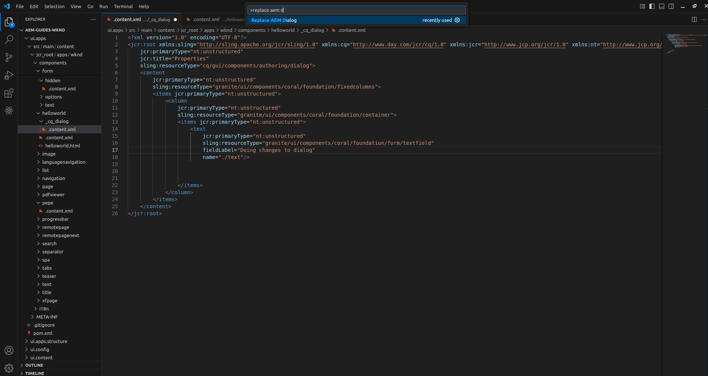
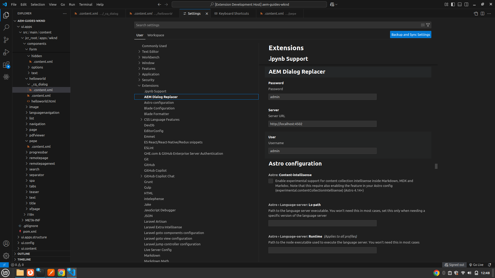

# AEM Dialog Replacer 

AEM ​​Dialog Replacer is an extension that allows you to replace the content of a dialog with the version that we have in our instance of Visual Studio Code, the purpose of this extension is to be able to update the dialogs without having to compile, since the existing extensions do not upload the dialog with the "replace" mode and can cause problems if, for example, we delete fields.

## Features

You can replace the content of an AEM instance dialog only opening the .xml file of the dialog and launching "Replace AEM Dialog" command. 

You can set the configuration of the extension to specify the URL of the instance you want to use and the credentials:

## Requirements

* Visual Studio Code 1.99 version or higer is required

## Release Notes

### 1.0.0

Initial release of AEM Dialog Replacer extension

